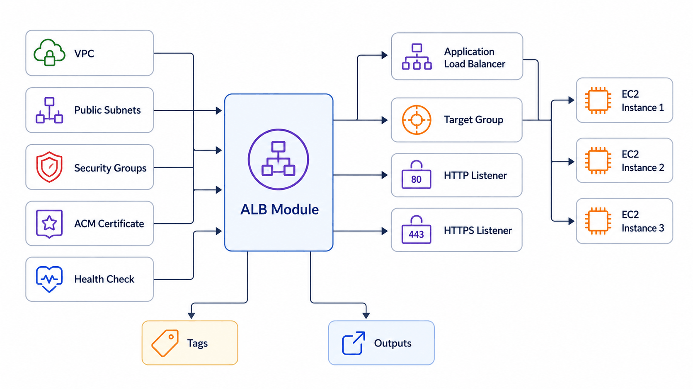

# Application Load Balancer Example

This example demonstrates how to deploy an AWS Application Load Balancer (ALB) using the reusable ALB module.

---

## Resources Created

- Application Load Balancer
- Target Group
- HTTP Listener
- HTTPS Listener (optional)
- HTTP → HTTPS Redirect
- Health Checks
- Target Group Attachments

---

## Architecture



---

## Usage

Copy the example variables:

```bash
cp terraform.tfvars.example terraform.tfvars
```

Initialize Terraform:

```bash
terraform init
```

Validate the configuration:

```bash
terraform validate
```

Review the execution plan:

```bash
terraform plan
```

Deploy the infrastructure:

```bash
terraform apply
```

Destroy the infrastructure:

```bash
terraform destroy
```

---

## Example Deployment

This example provisions:

- Internet-facing Application Load Balancer
- HTTP Listener
- HTTPS Listener
- HTTP → HTTPS Redirect
- Target Group
- EC2 Target Registration
- Health Checks

---

## Integration

This example is intended to be used together with:

- VPC Module
- Security Group Module
- EC2 Module

Replace the placeholder values in `terraform.tfvars` with outputs from those modules for a complete end-to-end deployment.

Example:

```hcl
vpc_id = module.vpc.vpc_id

public_subnet_ids = [
  module.vpc.public_subnet_ids[0],
  module.vpc.public_subnet_ids[1]
]

security_group_ids = [
  module.alb_security_group.security_group_id
]

target_ids = [
  module.ec2.instance_id
]
```

---

## Expected Outputs

After deployment Terraform will display:

- ALB ARN
- ALB DNS Name
- Hosted Zone ID
- Target Group ARN
- Target Group Name
- HTTP Listener ARN
- HTTPS Listener ARN

---

## Cleanup

```bash
terraform destroy
```
