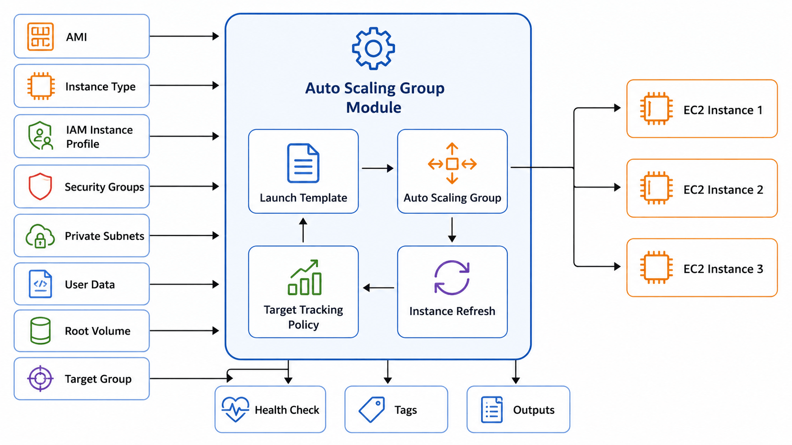

# Auto Scaling Group Example

This example demonstrates how to deploy an AWS Auto Scaling Group (ASG) using the reusable ASG module.

---

## Resources Created

- Launch Template
- Auto Scaling Group
- Target Tracking Scaling Policy
- Instance Refresh
- Target Group Attachment

---

## Architecture



---

## Usage

Copy the example variables:

```bash
cp terraform.tfvars.example terraform.tfvars
```

Initialize Terraform:

```bash
terraform init
```

Validate the configuration:

```bash
terraform validate
```

Review the execution plan:

```bash
terraform plan
```

Deploy the infrastructure:

```bash
terraform apply
```

Destroy the infrastructure:

```bash
terraform destroy
```

---

## Example Deployment

This example provisions:

- Launch Template
- Auto Scaling Group
- Target Tracking Scaling Policy
- CPU-based Auto Scaling
- Instance Refresh
- ALB Target Group Attachment

---

## Integration

This example is intended to be used together with:

- VPC Module
- Security Group Module
- IAM Module
- EC2 Module
- Application Load Balancer Module

Replace the placeholder values in `terraform.tfvars` with outputs from those modules for a complete deployment.

Example:

```hcl
private_subnet_ids = module.vpc.private_subnet_ids

security_group_ids = [
  module.security_group.security_group_id
]

target_group_arns = [
  module.alb.target_group_arn
]

instance_profile = module.iam.instance_profile_name
```

---

## Expected Outputs

After deployment Terraform will display:

- Launch Template ID
- Launch Template ARN
- Launch Template Latest Version
- Auto Scaling Group ID
- Auto Scaling Group Name
- Auto Scaling Group ARN
- Target Tracking Scaling Policy ARN

---

## Cleanup

```bash
terraform destroy
```
