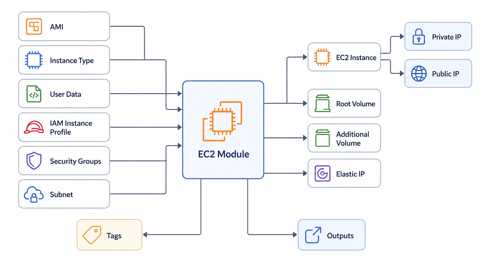

# EC2 Module Example

This example demonstrates how to deploy a reusable Ubuntu web server using the EC2 module.

## Resources Created

- EC2 Instance
- IAM Instance Profile
- Security Group Association
- Root GP3 Volume
- Additional GP3 Volume
- Elastic IP
- User Data Bootstrap (Nginx)

---

## Architecture



---

## Usage

Copy the example variables:

```bash
cp terraform.tfvars.example terraform.tfvars
```

Initialize Terraform:

```bash
terraform init
```

Validate the configuration:

```bash
terraform validate
```

Review the execution plan:

```bash
terraform plan
```

Deploy the infrastructure:

```bash
terraform apply
```

Destroy the infrastructure:

```bash
terraform destroy
```

---

## Example Deployment

The example provisions:

- Ubuntu EC2 Instance
- t3.micro
- User Data bootstrap
- Nginx Web Server
- Public IP
- Elastic IP
- Additional 40 GB GP3 EBS Volume

---

## Integration

This example is intended to be used together with:

- VPC Module
- Security Group Module
- IAM Module

Replace the placeholder values in `terraform.tfvars` with outputs from those modules for a complete end-to-end deployment.

---

## Expected Outputs

After a successful deployment, Terraform will display:

- Instance ID
- Instance ARN
- Private IP
- Public IP
- Public DNS
- Private DNS
- Availability Zone
- Root Volume ID
- Additional Volume ID
- Elastic IP

---

## Cleanup

```bash
terraform destroy
```
