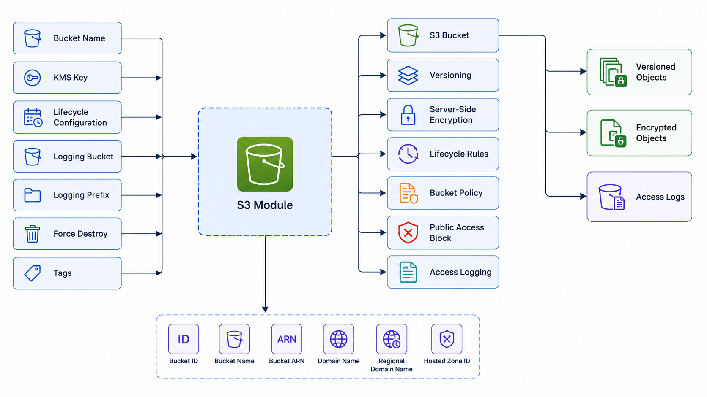

# S3 Module Example

This example demonstrates how to deploy a secure Amazon S3 bucket using the reusable S3 module.

---

## Resources Created

- S3 Bucket
- Bucket Versioning
- Server-Side Encryption
- Lifecycle Rule
- Bucket Policy
- Public Access Block
- Optional Access Logging

---

## Architecture



---

## Usage

Copy the example variables:

```bash
cp terraform.tfvars.example terraform.tfvars
```

Initialize Terraform:

```bash
terraform init
```

Validate the configuration:

```bash
terraform validate
```

Review the execution plan:

```bash
terraform plan
```

Deploy the infrastructure:

```bash
terraform apply
```

Destroy the infrastructure:

```bash
terraform destroy
```

---

## Example Deployment

This example provisions:

- Secure S3 bucket
- Versioning enabled
- AES256 server-side encryption
- Public access blocked
- HTTPS-only bucket policy
- Lifecycle rule for log expiration

---

## Integration

This module can be used together with:

- VPC Module
- Security Group Module
- IAM Module
- EC2 Module
- Application Load Balancer Module
- Auto Scaling Group Module

Typical use cases include:

- ALB access logs
- Application uploads
- Static website assets
- Backup storage
- Terraform remote state (with additional configuration)

---

## Expected Outputs

After deployment Terraform displays:

- Bucket ID
- Bucket Name
- Bucket ARN
- Bucket Domain Name
- Regional Bucket Domain Name
- Hosted Zone ID

---

## Cleanup

```bash
terraform destroy
```
