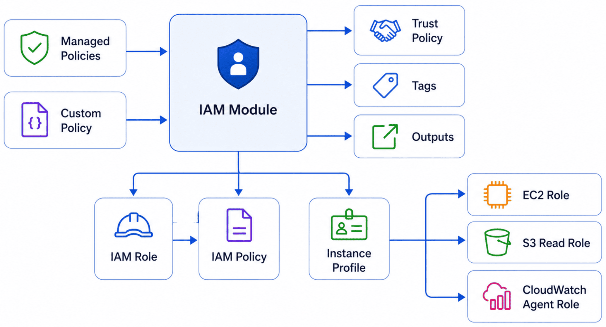

# IAM Module

Reusable Terraform module for provisioning AWS IAM Roles, managed policy attachments, optional custom IAM policies, and optional EC2 instance profiles.

---

## Features

- IAM Role
- Managed Policy Attachments
- Optional Custom IAM Policy
- Optional EC2 Instance Profile
- Resource Tagging
- Terraform 1.6+
- AWS Provider 6.x

---

## Architecture



---

## Usage

```hcl
module "iam" {
  source = "../../modules/iam"

  role_name = "example-role"

  trust_policy = jsonencode({
    Version = "2012-10-17"

    Statement = [{
      Effect = "Allow"

      Principal = {
        Service = "ec2.amazonaws.com"
      }

      Action = "sts:AssumeRole"
    }]
  })

  managed_policy_arns = [
    "arn:aws:iam::aws:policy/AmazonSSMManagedInstanceCore"
  ]

  create_instance_profile = true

  project     = "terraform-aws-platform"
  environment = "dev"
}
```

---

<!-- BEGIN_TF_DOCS -->
## Requirements

| Name | Version |
| ---- | ------- |
| <a name="requirement_terraform"></a> [terraform](#requirement\_terraform) | >= 1.6.0 |
| <a name="requirement_aws"></a> [aws](#requirement\_aws) | ~> 6.0 |

## Providers

| Name | Version |
| ---- | ------- |
| <a name="provider_aws"></a> [aws](#provider\_aws) | ~> 6.0 |

## Modules

No modules.

## Resources

| Name | Type |
| ---- | ---- |
| [aws_iam_instance_profile.main](https://registry.terraform.io/providers/hashicorp/aws/latest/docs/resources/iam_instance_profile) | resource |
| [aws_iam_policy.main](https://registry.terraform.io/providers/hashicorp/aws/latest/docs/resources/iam_policy) | resource |
| [aws_iam_role.main](https://registry.terraform.io/providers/hashicorp/aws/latest/docs/resources/iam_role) | resource |
| [aws_iam_role_policy_attachment.custom](https://registry.terraform.io/providers/hashicorp/aws/latest/docs/resources/iam_role_policy_attachment) | resource |
| [aws_iam_role_policy_attachment.managed](https://registry.terraform.io/providers/hashicorp/aws/latest/docs/resources/iam_role_policy_attachment) | resource |

## Inputs

| Name | Description | Type | Default | Required |
| ---- | ----------- | ---- | ------- | :------: |
| <a name="input_create_instance_profile"></a> [create\_instance\_profile](#input\_create\_instance\_profile) | Create an EC2 instance profile. | `bool` | `false` | no |
| <a name="input_custom_policy_document"></a> [custom\_policy\_document](#input\_custom\_policy\_document) | Optional custom IAM policy document in JSON. | `string` | `null` | no |
| <a name="input_environment"></a> [environment](#input\_environment) | Deployment environment. | `string` | n/a | yes |
| <a name="input_managed_policy_arns"></a> [managed\_policy\_arns](#input\_managed\_policy\_arns) | List of AWS managed policy ARNs. | `list(string)` | `[]` | no |
| <a name="input_project"></a> [project](#input\_project) | Project name. | `string` | n/a | yes |
| <a name="input_role_name"></a> [role\_name](#input\_role\_name) | Name of the IAM role. | `string` | n/a | yes |
| <a name="input_tags"></a> [tags](#input\_tags) | Additional tags. | `map(string)` | `{}` | no |
| <a name="input_trust_policy"></a> [trust\_policy](#input\_trust\_policy) | IAM trust policy in JSON format. | `string` | n/a | yes |

## Outputs

| Name | Description |
| ---- | ----------- |
| <a name="output_instance_profile_arn"></a> [instance\_profile\_arn](#output\_instance\_profile\_arn) | ARN of the IAM instance profile. |
| <a name="output_instance_profile_name"></a> [instance\_profile\_name](#output\_instance\_profile\_name) | Name of the IAM instance profile. |
| <a name="output_policy_arn"></a> [policy\_arn](#output\_policy\_arn) | ARN of the custom IAM policy. |
| <a name="output_policy_name"></a> [policy\_name](#output\_policy\_name) | Name of the custom IAM policy. |
| <a name="output_role_arn"></a> [role\_arn](#output\_role\_arn) | ARN of the IAM role. |
| <a name="output_role_name"></a> [role\_name](#output\_role\_name) | Name of the IAM role. |
<!-- END_TF_DOCS -->
