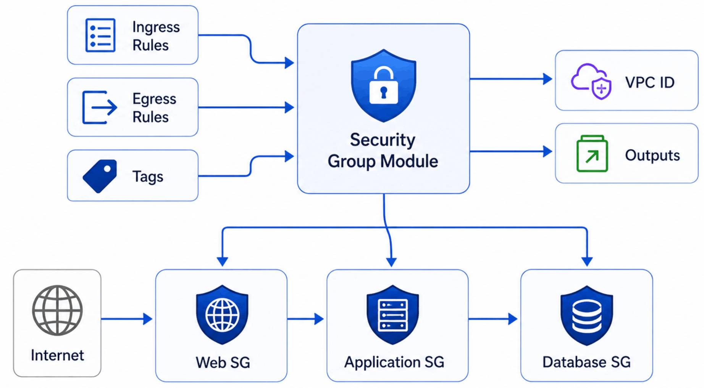

# AWS Security Group Module

Reusable Terraform module for provisioning AWS Security Groups with configurable ingress and egress rules.

The module is designed following Infrastructure as Code (IaC) best practices and supports reusable, production-ready network security configurations for AWS workloads.

## Features

- Create reusable AWS Security Groups
- Configure multiple ingress rules
- Configure multiple egress rules
- Support IPv4 and IPv6 CIDR blocks
- Support Security Group references
- Support AWS Prefix Lists
- Consistent tagging strategy
- Compatible with AWS Provider v6

## Architecture



## Usage

```hcl
module "web_security_group" {
  source = "../../modules/security-group"

  name        = "web-sg"
  description = "Security Group for Web Tier"

  vpc_id = "vpc-xxxxxxxx"

  project     = "terraform-aws-platform"
  environment = "dev"

  ingress_rules = [
    {
      description = "HTTPS"
      from_port   = 443
      to_port     = 443
      protocol    = "tcp"
      cidr_ipv4   = "0.0.0.0/0"
    }
  ]

  egress_rules = [
    {
      description = "All outbound traffic"
      from_port   = 0
      to_port     = 0
      protocol    = "-1"
      cidr_ipv4   = "0.0.0.0/0"
    }
  ]
}
```

## Example

A complete example is available in:

```text
examples/security-group/
```

<!-- BEGIN_TF_DOCS -->
## Requirements

| Name | Version |
| ---- | ------- |
| <a name="requirement_terraform"></a> [terraform](#requirement\_terraform) | >= 1.6.0 |
| <a name="requirement_aws"></a> [aws](#requirement\_aws) | ~> 6.0 |

## Providers

| Name | Version |
| ---- | ------- |
| <a name="provider_aws"></a> [aws](#provider\_aws) | 6.57.1 |

## Modules

No modules.

## Resources

| Name | Type |
| ---- | ---- |
| [aws_security_group.main](https://registry.terraform.io/providers/hashicorp/aws/latest/docs/resources/security_group) | resource |
| [aws_vpc_security_group_egress_rule.this](https://registry.terraform.io/providers/hashicorp/aws/latest/docs/resources/vpc_security_group_egress_rule) | resource |
| [aws_vpc_security_group_ingress_rule.this](https://registry.terraform.io/providers/hashicorp/aws/latest/docs/resources/vpc_security_group_ingress_rule) | resource |

## Inputs

| Name | Description | Type | Default | Required |
| ---- | ----------- | ---- | ------- | :------: |
| <a name="input_description"></a> [description](#input\_description) | Description of the Security Group. | `string` | `"Managed by Terraform"` | no |
| <a name="input_egress_rules"></a> [egress\_rules](#input\_egress\_rules) | Egress rules. | <pre>list(object({<br/>    description       = optional(string)<br/>    from_port         = number<br/>    to_port           = number<br/>    protocol          = string<br/>    cidr_ipv4         = optional(string)<br/>    cidr_ipv6         = optional(string)<br/>    prefix_list_id    = optional(string)<br/>    security_group_id = optional(string)<br/>  }))</pre> | `[]` | no |
| <a name="input_environment"></a> [environment](#input\_environment) | Deployment environment. | `string` | n/a | yes |
| <a name="input_ingress_rules"></a> [ingress\_rules](#input\_ingress\_rules) | Ingress rules. | <pre>list(object({<br/>    description       = optional(string)<br/>    from_port         = number<br/>    to_port           = number<br/>    protocol          = string<br/>    cidr_ipv4         = optional(string)<br/>    cidr_ipv6         = optional(string)<br/>    prefix_list_id    = optional(string)<br/>    security_group_id = optional(string)<br/>  }))</pre> | `[]` | no |
| <a name="input_name"></a> [name](#input\_name) | Name of the Security Group. | `string` | n/a | yes |
| <a name="input_project"></a> [project](#input\_project) | Project name. | `string` | n/a | yes |
| <a name="input_tags"></a> [tags](#input\_tags) | Additional tags. | `map(string)` | `{}` | no |
| <a name="input_vpc_id"></a> [vpc\_id](#input\_vpc\_id) | VPC ID where the Security Group will be created. | `string` | n/a | yes |

## Outputs

| Name | Description |
| ---- | ----------- |
| <a name="output_security_group_arn"></a> [security\_group\_arn](#output\_security\_group\_arn) | ARN of the Security Group. |
| <a name="output_security_group_id"></a> [security\_group\_id](#output\_security\_group\_id) | ID of the Security Group. |
| <a name="output_security_group_name"></a> [security\_group\_name](#output\_security\_group\_name) | Name of the Security Group. |
<!-- END_TF_DOCS -->
